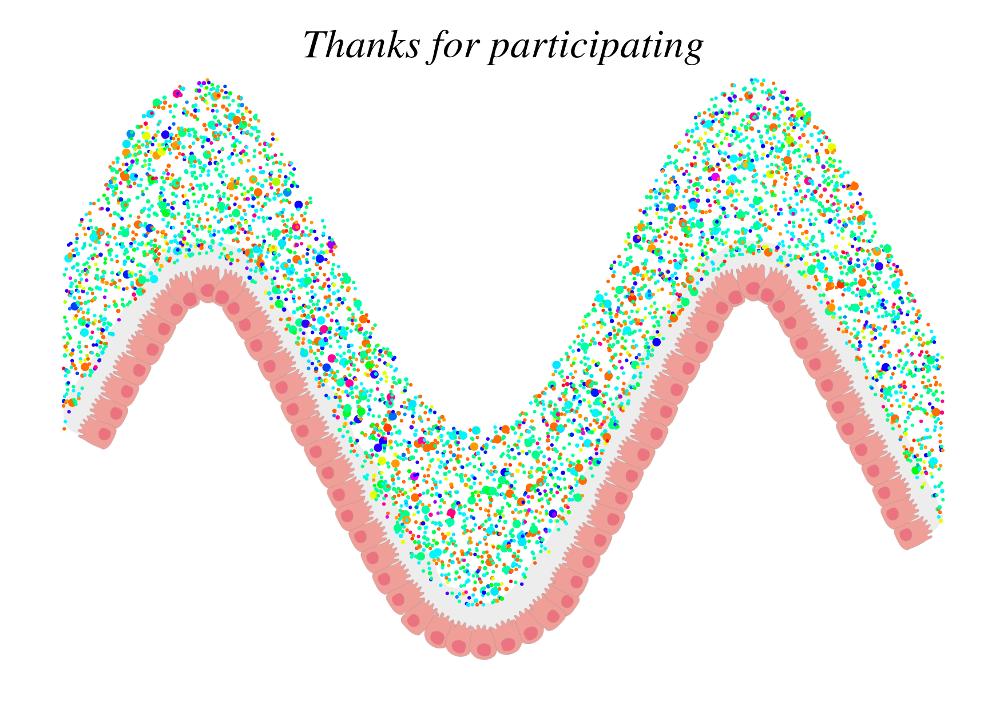

# micRowave: A visual representation of individual microbiome profiles for participant engagement

## Motivation

Participants involved in microbiome studies are often interested in receiving feedback on their own data. It is important
to try and accomodate this interest in order to foster participant engagement.

## What micRowave does

MicRowave attempts to address participant egagement by creating a visually appealing representation of participants' microbiome
profiles whilst retaining a level of abstraction that reduces a requirement for detailed explanation of the profile i.e which
bacteria are present and what is the relevance of the abundances of these organisms. To achieve this, micRowave takes a table
of taxonomic abundances as output in metagenomic or 16S rRNA analyses, contructs a data frame of points that represent different taxa,
colours the points by taxon and randomly distributes them across a wave. This provides a visual representation of an individual's
microbiome that only retains information regarding the taxonomic abundance of organisms - without a direct identification of those
organisms.

## Installation

micRowave is installable from github using the devtools package. An example dataset is loaded on loading of micRowave and can be run
using the following commands.

```
    install.packages("devtools")
    install_github("micRowave", "nilott")

    library("micRowave")
    microwave(genus_abundances, text="Thanks for participating")
```

This will produce two png files - sample1 is a profile from colon and sample2 is a profile from small intestine shown below.

sample1 - colon



sample2 - small intestine


